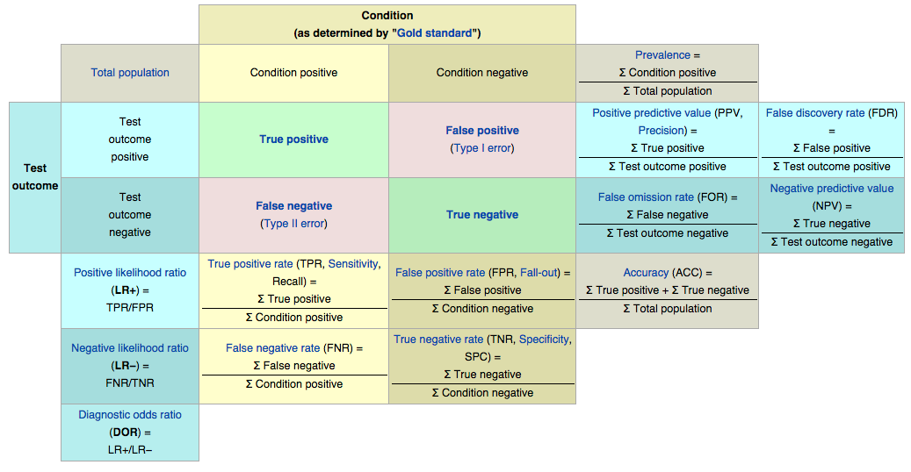
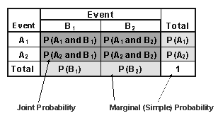
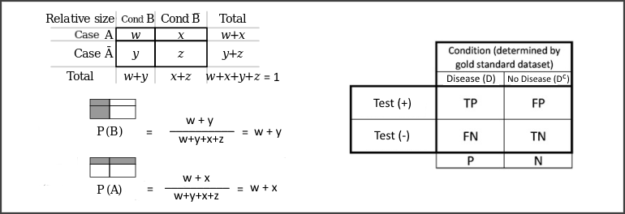
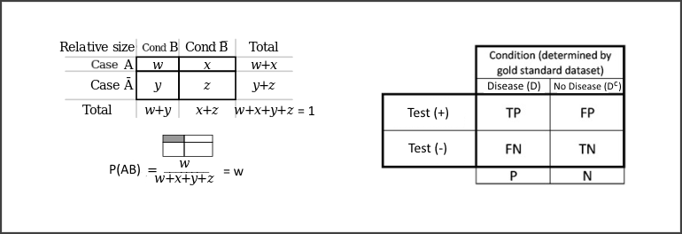
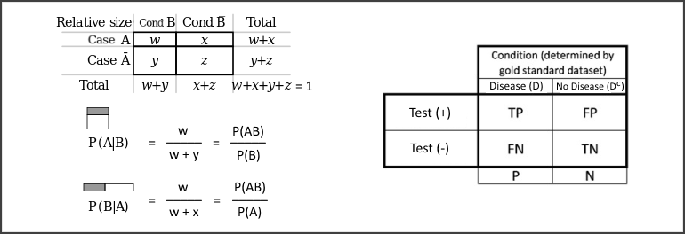
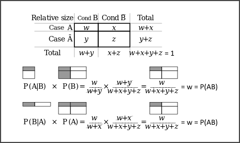

---


#### [Diagram](http://en.wikipedia.org/wiki/Receiver_operating_characteristic#Basic_concept): 



### In terms of probabilities:

---



$\\$

#### Marginal probabilities:

---



$\\$

*(being the condition for example a Disease)*

Probability of condition positive $\rightarrow p(D)= \text{TP+FN} \Rightarrow$ **PREVALENCE**

Probability of condition negative $\rightarrow p(D^c)= \text{FP+TN}$

Probability of test outcome positive $\rightarrow p(+)= \text{TP+FP}$

Probability of test outcome negative $\rightarrow p(-)= \text{FN+TN}$

$\\$

Where:

$p(\text{total})= \text{TP+FP+FN+TN} =1$

$p(D^c)=1-p(D) \equiv \text{FP+TN} =1- \text{(TP+FN)}$

$p(-)=1-p(+) \equiv \text{FN+TN} =1- \text{(TP+FP)}$

$\\$

#### Joint probabilities (intersections):

---



$\\$

Probability of $+$ and $D \rightarrow p(+ \cap D)= \text{TP}$

Probability of $-$ and $D \rightarrow p(- \cap D)= \text{FN}$

Probability of $+$ and $D^c \rightarrow p(+ \cap D^c)= \text{FP}$

Probability of $-$ and $D^c \rightarrow p(- \cap D^c)= \text{TN}$

$\\$

####  [Conditional probabilities](https://www.scribd.com/doc/246563489/Conditional-Probability):

---



$\\$

- <a name=back></a>*Test outcome* conditioned on *condition*

*(the probability of having a positive/negative test result for a patient that has/hasn't the disease)*

Probability of $+$ given $D \rightarrow p(+|D)=\frac{p(+ \cap D)}{p(D)}= \frac{\text{TP}}{\text{TP+FN}} \Rightarrow$ **SENSITIVITY**

Probability of $+$ given $D^c \rightarrow p(+|D^c)=\frac{p(+ \cap D^c)}{p(D^c)}=\frac{\text{FP}}{\text{FP+TN}} \Rightarrow$ **FALSE POSITIVE RATE** 
[(**FPR**)](#FPR_down)

Probability of $-$ given $D^c \rightarrow p(-|D^c)=\frac{p(- \cap D^c)}{p(D^c)}=\frac{\text{TN}}{\text{FP+TN}} \Rightarrow$ **SPECIFICITY**

Probability of $-$ given $D \rightarrow p(-|D)=\frac{p(- \cap D)}{p(D)}=\frac{\text{FN}}{\text{TP+FN}} \Rightarrow$ **FALSE NEGATIVE RATE** [(**FNR**)](#FNR_down)

$\\$

Where:

$p(+|D^c)=1-p(-|D^c) \equiv \frac{\text{FP}}{\text{FP+TN}} = 1 - \frac{\text{TN}}{\text{FP+TN}} \rightarrow \text{FPR} = 1 - \text{SPECIFICITY}$

$p(-|D)=1-p(+|D) \equiv \frac{\text{FN}}{\text{TP+FN}} = 1 - \frac{\text{TP}}{\text{TP+FN}} \rightarrow \text{FNR} = 1 - \text{SENSITIVITY}$

$\\$

- *Condition* conditioned on *test outcome*

*(the probability of having/not having the disease if the test result is positive/negative)*

Probability of $D$ given $+ \rightarrow p(D|+)=\frac{p(+ \cap D)}{p(+)}=\frac{\text{TP}}{\text{TP+FP}} \Rightarrow$ **POSITIVE PREDICTIVE VALUE (PPV, PRECISION)**

Probability of $D$ given $- \rightarrow p(D|-)=\frac{p(+ \cap D)}{p(-)}=\frac{\text{FN}}{\text{TP+FP}} \Rightarrow$ FALSE OMISSION RATE (FOR)

Probability of $D^c$ given $+ \rightarrow p(D^c|+)=\frac{p(+ \cap D^c)}{p(+)}=\frac{\text{FP}}{\text{TP+FP}} \Rightarrow$ FALSE DISCOVERY RATE (FDR)

Probability of $D^c$ given $- \rightarrow p(D^c|-)=\frac{p(- \cap D^c)}{p(-)}=\frac{\text{TN}}{\text{FP+TN}} \Rightarrow$ **NEGATIVE PREDICTIVE VALUE (NPV)**

$\\$

#### Bayes' theorem:

---

$p(A|B)=\frac{p(B|A)p(A)}{p(B)} \rightarrow p(A|B)p(B)=p(B|A)p(A)$

Demonstration:

$\\$



$\\$

$\text{SENSITIVITY}:p(+|D)=\frac{p(+ \cap D)}{p(D)}$

$\text{PPV}:p(D|+)=\frac{p(+ \cap D)}{p(+)}$

Then:

$\rightarrow p(+ \cap D)=p(+|D)p(D)=p(D|+)p(+) \Rightarrow \text{TP}=\text{SENSITIVITY}*\text{PREVALENCE}=\text{PPV}*\text{(TP+FP)}$

$\\$

#### Bayes' rule:

$p(B|A)=\frac{p(A|B)p(B)}{p(A|B)p(B)+p(A|B^c)p(B^c)}$

Bayes' theorem: 

$p(B|A)=\frac{p(A|B)p(B)}{p(A)}$

Then:

$\rightarrow p(A)=p(A|B)p(B)+p(A|B^c)p(B^c)$

$\\$

Demonstration:

$p(+)=p(+|D)p(D)+p(+|D^c)p(D^c)=p(+ \cap D)+p(+ \cap D^c) \Rightarrow \text{TP+FP}=\text{TP+FP}$

$\\$

Application:

$p(D|+)=\frac{p(+|D)p(D)}{p(+|D)p(D)+p(+|D^c)p(D^c)} \Rightarrow \text{PPV}=\frac{\text{SENSITIVITY*PREVALENCE}}{\text{SENSITIVITY*PREVALENCE}+(1-\text{SPECIFICITY})*(1-\text{PREVALENCE})}$

$\\$

#### Likelihood ratios:

Bayes' rule:

$\text{PPV} = p(D|+) = \frac{p(+|D)p(D)}{p(+|D)p(D)+p(+|D^c)p(D^c)}$

$\text{FDR} = p(D^c|+) = \frac{p(+|D^c)p(D^c)}{p(+|D)p(D)+p(+|D^c)p(D^c)}$

$\\$

Then:

$\rightarrow \frac{p(D|+)}{p(D^c|+)} = \frac{p(+|D)}{p(+|D^c)} * \frac{P(D)}{P(D^c)} \Rightarrow \text{POST TEST ODDS} = \text{DLR}_{+} * \text{PRE TEST ODDS} \Rightarrow \text{DLR}_{+} = \frac{\text{POST TEST ODDS}}{\text{PRE TEST ODDS}}$

$\\$

$\text{DLR}_{+}$ relates the increase in the odds of the disease after a positive test result to the odds of disease prior to the test.

$\\$

Similarly:

$\rightarrow \frac{p(D|-)}{p(D^c|-)} = \frac{p(-|D)}{p(-|D^c)} * \frac{P(D)}{P(D^c)} \Rightarrow \text{POST TEST ODDS} = \text{DLR}_{-} * \text{PRE TEST ODDS} \Rightarrow \text{DLR}_{-} = \frac{\text{POST TEST ODDS}}{\text{PRE TEST ODDS}}$

$\\$

$\text{DLR}_{-}$ relates the decrease in the odds of the disease after a negative test result to the odds of disease prior to the test.

$\\$

---

#### <a name=FPR_down></a>[Type I and II errors](http://es.wikipedia.org/wiki/Errores_de_tipo_I_y_de_tipo_II)

---

The **FPR** is a **Type I error** ($\alpha$ type error): 

$p(+|D^c) \equiv p \text{(rejecting H0 | H0 is true)}$

We are rejecting the null hypothesis "there are no significant differences with the '*normal state*' population" when we souldn't, that is, we are considering that the pacient doesn't belong to the healthy population because he falls into the rejection region determined by the $\alpha$ significance level.

This happens because the two populations ('*normal state*' = condition negative = no disease, and '*altered state*' = condition positive = disease) overlap to some extent, so:

- the bigger the significance level, the more we are assuring the 'integrity' of the '*normal state*' population: we maximize true positives at the expense of maximizing false positives (bigger $\alpha$ $\rightarrow$ more Type I error)

- the smaller the significance level, the more we are assuring the integrity of the '*altered state*' population: we minimize false positives at the expense of minimizing true positives (smaller $\alpha$ $\rightarrow$ less Type I error)

[back](#back)

<a name="FNR_down"></a>
$\\$


$\\$

The **FNR** is a **Type II error** ($\beta$ type error):

$p(-|D) \equiv p \text{(not rejecting H0 | H0 is not true)}$

We aren't rejecting the null hypothesis when we should, that is, we are considering that the pacient is no significantly different than the '*normal state*' population because he doesn't fall into the $\alpha$ region.

Again, this happens because the two populations are overlapping: the more they do (the closer their means are to each other), the less we are able to discern between the two populations $\rightarrow$ the less we reject the null hypothesis (more false negatives). In this case we can't control the extension of the $\beta$ region since it is determined by the mean of the alternative population.

[back](#back)

---


```r
sessionInfo()
```

```
## R version 3.1.2 (2014-10-31)
## Platform: x86_64-pc-linux-gnu (64-bit)
## 
## locale:
##  [1] LC_CTYPE=en_GB.UTF-8       LC_NUMERIC=C              
##  [3] LC_TIME=en_GB.UTF-8        LC_COLLATE=en_GB.UTF-8    
##  [5] LC_MONETARY=en_GB.UTF-8    LC_MESSAGES=en_GB.UTF-8   
##  [7] LC_PAPER=en_GB.UTF-8       LC_NAME=C                 
##  [9] LC_ADDRESS=C               LC_TELEPHONE=C            
## [11] LC_MEASUREMENT=en_GB.UTF-8 LC_IDENTIFICATION=C       
## 
## attached base packages:
## [1] stats     graphics  grDevices utils     datasets  methods   base     
## 
## other attached packages:
## [1] knitr_1.7
## 
## loaded via a namespace (and not attached):
## [1] digest_0.6.3     evaluate_0.5.5   formatR_1.0      htmltools_0.2.6 
## [5] rmarkdown_0.3.12 stringr_0.6.2    tools_3.1.2      yaml_2.1.13
```
